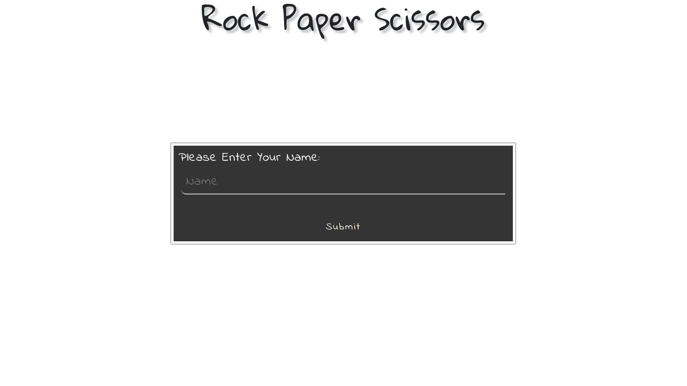
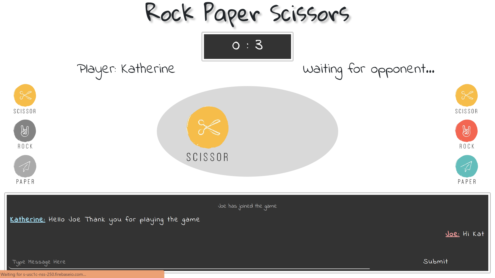

# RPS-Multiplayer
Rock Paper Sissors

# TriviaGame

## _Rock_Paper_Scissors_(Challenge)_
The seventh assignment of Columbia Coding Bootcamp. 

 
Link to the RPS game:  
https://kitkat0202.github.io/RPS-Multiplayer/

   
# Finished Product:

   
# Project INFO:
- You will need a friend tp enjoy this game, if you don't have one... I'm sorry XD

- This game allows multiple groups of players so if you have 4 people it can still work

- The messaging system is for the u player ingame only, so dont worry about accidentally spill your private secrests.

   
### Instructions

* Create a game that suits this user story:

* Only two users can play at the same time.

* Both players pick either `rock`, `paper` or `scissors`. After the players make their selection, the game will tell them whether a tie occurred or if one player defeated the other.

* The game will track each player's wins and losses.

* Throw some chat functionality in there! No online multiplayer game is complete without having to endure endless taunts and insults from your jerk opponent.

* Styling and theme are completely up to you. Get Creative!

* Deploy your assignment to Github Pages.